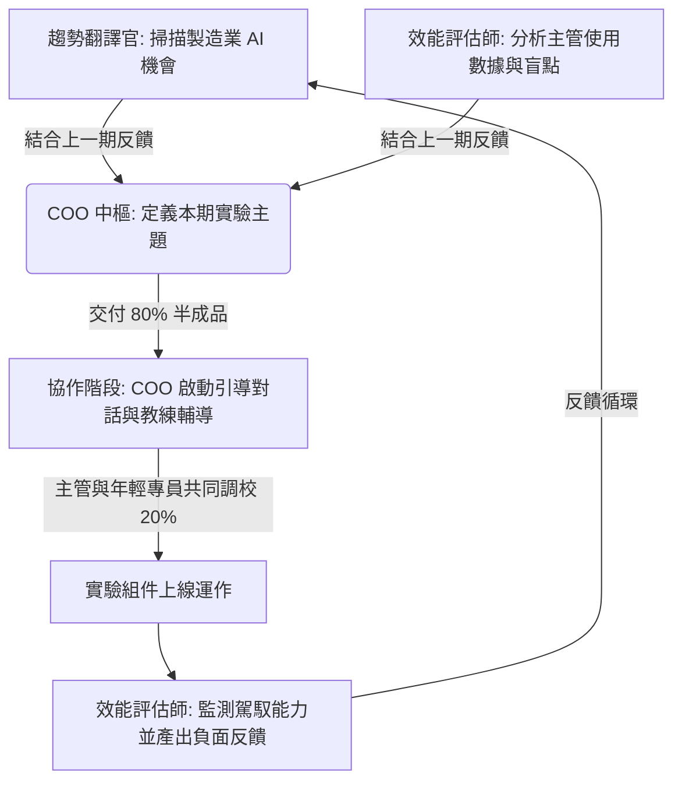

# 興華精密機械：跨世代 AI 共生與數位大腦升級服務方案 (v1)

本方案為 **The AI Navigator Lab** 依據興華精密機械之轉型痛點與本實驗室的核心能力，所量身設計的長期 AI 參謀與共生服務方案。

---

## 一、 設計理念：半成品美學與尊嚴保障
興華精密機械擁有 35 年深厚的傳統零件製造實務經驗，其轉型的最大瓶頸非技術不足，而是**資深主管的技術恐懼與自尊剝奪感**。

本方案的核心理念為：
> [!IMPORTANT]
> **以「半成品」重塑主管的駕馭感**
> 我們拒絕提供「完全不用動手」的交鑰匙黑盒子軟體，而是交付 **80% 完成度的 Agent 半成品組件**。留下 **20% 的調校空間**，必須由資深主管注入其 35 年的產線調度與採購實務經驗（Domain Know-how）才能運作。這能確保主管掌握最後的「調教權」，重建其在 AI 時代的專業尊嚴。

---

## 二、 服務架構與標準交付物 (Deliverables)

本方案採用 **B2B 企業訂閱羅賓漢模式**，每月費用為 45,000 NTD。每週期（月）標準交付包包含：

### 1. 導航指南 (The Navigator’s Log)
* **趨勢轉譯（趨勢翻譯官撰寫）**：每週分析全球智慧製造與供應鏈 AI 應用報告，去除技術術語，將其轉化為生管、採購主管可直接理解的獲利機會與行動點。
* **組織健康與駕馭力評估（效能評估師撰寫）**：基於匿名平台的使用軌跡，評估主管對於 AI 的「問題定義與駕馭能力」，並提供跨世代溝通摩擦點的情緒溫度分析。

### 2. 實驗代碼庫 (The Experiment Codebase)
* **半成品 Agent 組件（實驗設計師開發）**：
  * **「敏捷生管排程輔助 Agent」半成品**：內建核心排程演算法架構，但保留 `TODO: 產線緊急插單與師傅經驗加權規則` 區塊，需由生管主管親自設定。
  - **「採購詢比價決策 Agent」半成品**：可自動整理多方供應商數據，但保留 `TODO: 供應商信任度加權與談判策略` 區塊，需由採購主管填寫。

### 3. 調教說明書 (The Tuning Manual)
* 提供專為非技術背景主管設計的互動式 Markdown 指南，一步步引導主管如何利用自身經驗完成上述組件的最後配置。
* 提供「跨世代協同調校指南」，引導年輕專員如何以「技術幕僚」角色協助主管，而非直接取代主管的工作。

---

## 三、 專才協同運作流程 (The Lab Workflow)

本方案的運作流程由 **COO** 進行中樞協調，並由三位專才協同執行：

1. **攝取階段 (Ingestion)**：
   * **趨勢翻譯官** 掃描外部市場，將複雜的工業 AI 文獻翻譯為「興華精密機械機會點」。
   * **效能評估師** 檢核上週主管的適應數據，COO 整合兩者，定義本月的實驗主題（例如：六月份為「排程應變力優化」）。
2. **協作階段 (Co-Creation)**：
   * **COO** 啟動引導對話，將「半成品組件」與「調教說明書」交付給興華的主管。
   * COO 提供「教練指導」，協助主管在匿名互助平台（知識交易池）上與年輕專員合作，完成剩餘 20% 的客製化配置。
3. **優化階段 (Optimization)**：
   * **效能評估師** 監測操作反應，分析是否有「舊時代思維殘留（如過度依賴傳統 SOP 或拒絕授權給 AI）」，並將評估結果直接回饋至下期的設計中。

---

## 四、 6 月份兩週封閉測試 (PoC) 實施計畫

為確保正式導入順利，我們將於 2026 年 6 月開啟為期兩週的 PoC 測試：

| 階段與時間 | 核心任務 | 交付物件 | 專才角色職掌 |
| :--- | :--- | :--- | :--- |
| **第一週： 認知卸載與半成品初探** | 化解技術焦慮，引導主管體驗「調教權」。 | 1. 智慧製造趨勢簡報 2. 生管排程輔助 Agent 半成品 (Python/Web UI) | **趨勢翻譯官**：產出無術語的機會診斷。 **實驗設計師**：提供註解極清晰、預留 20% TODO 的代碼與 UI 組件。 |
| **第二週： 跨世代匿名協作與評估** | 啟用匿名互助帳號，進行跨世代調校實驗；檢測轉型瓶頸。 | 1. 匿名互助平台測試帳號 2. 組織健康與駕馭力評估報告 | **COO**：啟動引導對話，引導主管與年輕專員協作。 **效能評估師**：收集數據，指出思維瓶頸與負面反饋。 |

---

## 五、 負面清單與服務邊界

> [!WARNING]
> **為維持諮詢與進化品質，我們嚴格遵守以下服務邊界：**
> 1. **不提供單次性 Prompts 代寫**：我們教導主管建立「Agent 組隊」思考框架，而非提供一次性抄寫的指令。
> 2. **不提供完全不用客戶參與的交鑰匙解決方案**：客戶必須親自參與最後 20% 的調校，否則無法達到共同進化的效果。
> 3. **不提供傳統軟體外包工程**：我們不負責與興華舊有老舊 ERP 系統進行傳統底層代碼對接，亦不提供代碼代工，我們交付的是「諮詢與半成品組件」。
